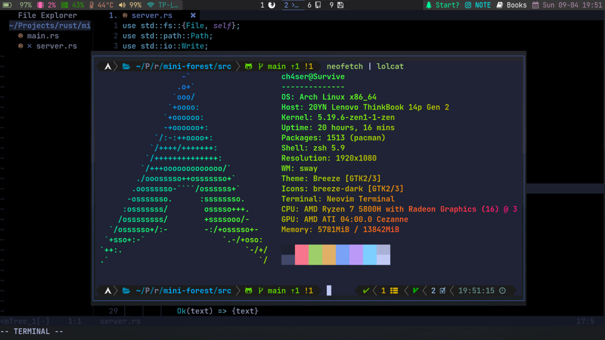

# ch4ser 的私人配置


本仓库用于备份个人配置文件


[TOC]
## 常用软件配置
### 桌面环境(sway + waybar + swaylock)
#### sway
1. 为不同应用分配了不同的workspace
2. 设置字体为JetBrainsMono Nerd Font Bold
3. *壁纸路径请自行修改*
4. 使用rofi作为应用启动的菜单
5. 使用slurp配合wl-copy来实现方便快速的截图复制功能
6. 设置了一堆键位，除了普通的键位绑定外，值得提到的小tip有
    - alt+tab 让用户快速切换到上一个workspace
    - alt+1/2 聚焦到左/右边的workspace，不需要非得Mod+num来切换workspace
    - 交换了caplocks和esc的位置
    - 设置smart_gaps让窗口与窗口之间填充一点空隙，同时在仅有一个窗口的时候不浪费空间
    - autotiling让新增窗口根据之前窗口的长宽比例自动判断该在水平方向还是垂直方向启动

#### waybar
包含的显示项目
- battery
- gpu usage
- ram
- temprature
- pulseaudio
- network
- workspaces
- mini-forest 倒计时软件，用于专注
- NOTE shortcut 打开我的笔记
- book search 搜索特定目录下的书本
- date & clock

#### swaylock
里面主要是一些颜色配置和壁纸设置，壁纸的路径请自行修改

### 终端环境(zsh + alacritty)
#### zsh
1. 添加todo.sh命令，每次打开终端都会罗列一天中的待办事项
2. fzf option设置，配合bat实现模糊文件预览，定义vim_fzf函数来模糊查询并用nvim打开查询结果文件
3. 使用框架为oh-my-zsh，安装插件如下
    - zsh-syntax-highlighting 用于命令行参数高亮
    - zsh-autosuggestions 用于命令提示
    - zsh-extract 用于使用``x``命令来快速解压所有类型的压缩文件
    - zsh-autoswitch-virtualenv 用于在进入存在python虚拟环境的项目时自动激活虚拟环境，在离开时自动结束虚拟环境
    - powerlevel10k 主题
4. 设置了一些alias，并替代了一些工具
    - exa 替代 ls
    - bottom 替代 top
    - bat 替代 cat
    - zoxide 替代 cd 和 autojump

#### Alacritty
使用solarized主题和Jetbrain Nerd Font字体,profile文件已经给出

### 浏览器(firefox)

#### firefox
1. custom toolbar --> 勾选 title bar --> 右边选density , 在sway下titlebar会被隐藏, 同时因为勾选了titlebar, tabs右侧的空间会被充分利用起来
2. `about:config` --> set `browser.compactmode.show` to true --> go toolbar adjust, select `density` to `compact`，让布局更加紧凑美观

### 文件管理(ranger + dolphin)

#### ranger
- ranger devicon plugin 负责显示文件图标,同时个性化了部分图标
- 使用fzf & ag 来在ranger下进行模糊文件查找,
    - 在ranger中按下f开始从当前目录开始进行模糊查找
    - 在ranger中按Ctrl-h显示隐藏文件后再按f可以从当前目录开始对包含隐藏目录在内的所有目录开始模糊查找.
    - 具体参考 https://github.com/ranger/ranger/wiki/Custom-Commands#fzf-integration
- 使用ranger_udisk_menu插件来方便ranger挂载设备
- 修改了copy paste 和 cut 命令，让ranger可以跨实例张贴文件


### 编辑器/IDE (Neovim + nvim-qt + jetbrains)
#### Neovim

```
.
├── gnvim.vim               // nvim-qt使用的配置文件入口
├── init.lua                // nvim 配置文件入口
├── lua
│   ├── base
│   │   └── init.lua        // 基础配置
│   ├── keymap
│   │   └── init.lua        // 键位设置
│   └── plugins
│       ├── edit
│       │   └── init.lua    // 编辑相关的插件(kommentary, todo-comment.nvim, nvim-autopairs, hop.nvim, telescope.nvim, clipboard-image.nvim, plenary.nvim, tabout.nvim)
│       ├── init.lua        // 插件配置文件入口
│       ├── interface
│       │   └── init.lua    // 界面相关的插件(bufferline.nvim, indent-blankline.nvim, lualine.nvim)
│       ├── lsp
│       │   └── init.lua    // 语言相关插件(cmp-nvim系列插件, nvim-treesitter, nvim-lsp-installer, nvim-dap, nvim-dap-ui, nvim-dap-go, lspsage.nvim)
│       ├── sideview
│       │   └── init.lua    // 侧边栏相关插件(nvim-tree.lua)
│       └── theme
│           └── init.lua    // 主题相关插件(tokyonight.nvim)
└── plugin
    └── packer_compiled.lua // 自动生成文件，不用管
```


如果有人想不开想要使用我的配置文件的话，安装步骤如下
- 安装packer.nvim 
- 进入lua/plugins/init.lua,将以下代码注释
```
edit_plugins.load()
interface_plugins.load()
sideview_plugins.load()
theme_plugins.load()
lsp_plugins.load()
```
- 保存后,将项目内的文件移到配置文件目录下，比如在我的archlinux上面是~/.config/nvim/
- 打开neovim运行PackerInstall
- 将刚刚注释的代码解除注释
- 保存，重新打开就行了

在neovim中呼出终端


模糊文件查找


代码补全


代码调试(golang)


#### nvim-qt
alacritty在wayland环境下无法输入中文，为了方便做笔记，我选用了nvim-qt来作为自己的笔记软件。

nvim-qt使用`gnvim.vim`作为配置文件，要让其加载nvim的lua配置文件

`gnvim.vim`
```vim
au UIAttach * ++once lua require('init')
```
可以运行命令`:GuiFont *`来设置nvim-qt的字体

#### jetbrains

不仅仅是jetbrains，所有的java应用在sway下使用的时候记得在环境变量中加上

```
_JAVA_AWT_WM_NONREPARENTING=1
```

### 阅读器(zathura)

#### zathura
- 为zathura设置了暗色和反色，效果更加柔和


## Others

项目中的背景图片路径请自行修改，图片位于image目录下
