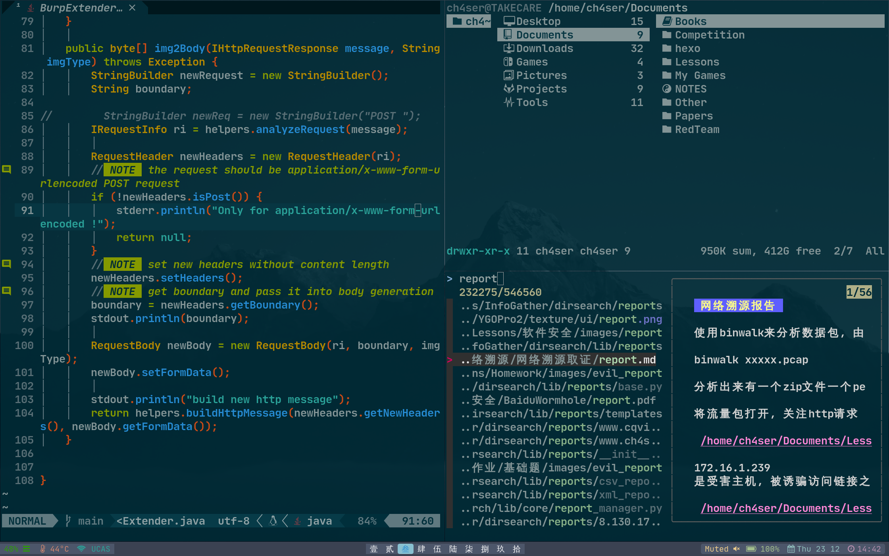
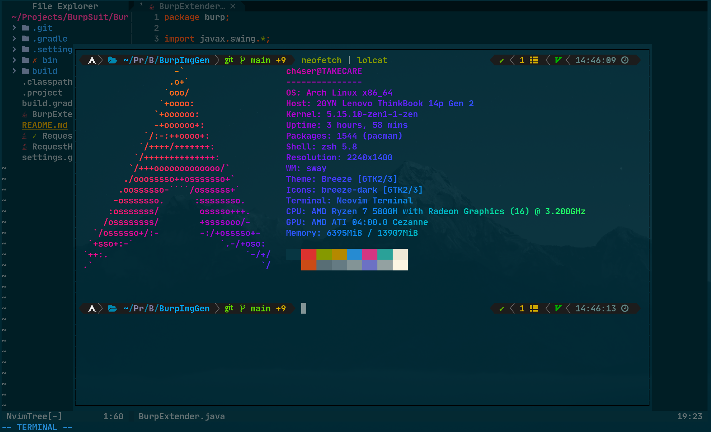
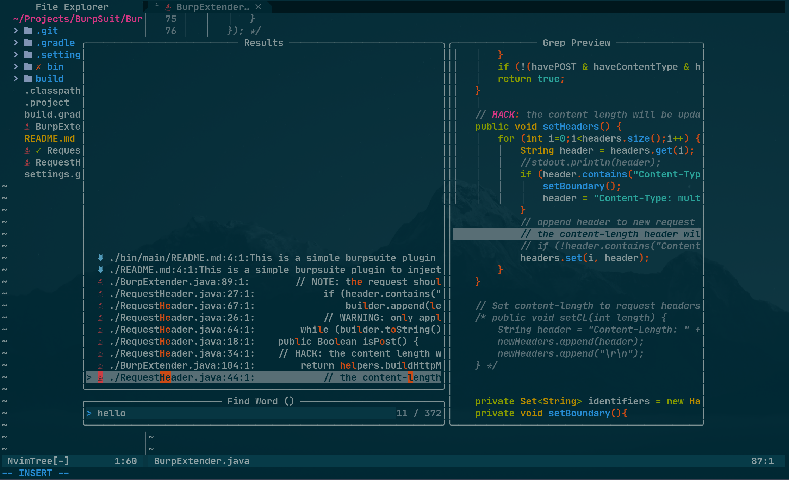
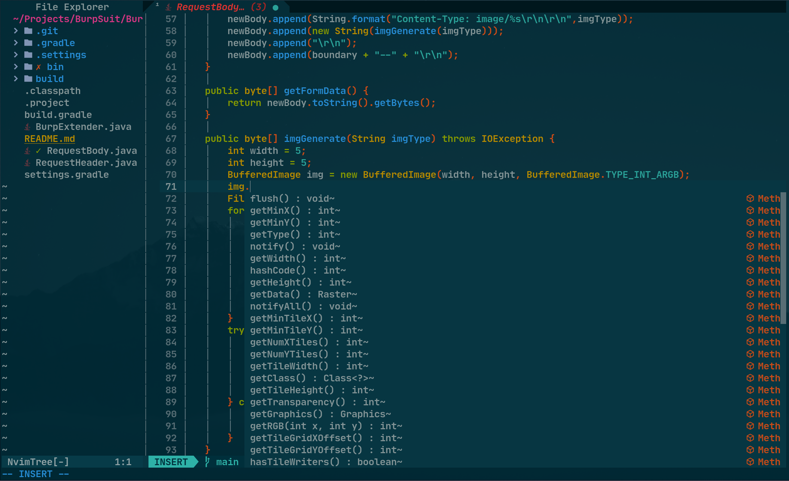

# ch4ser 的私人配置
本仓库用于备份个人配置文件


## zsh
使用powerlevel10k,并自定义一些快捷键比如ranger的打开等

## konsole
使用solarized主题和Jetbrain Nerd Font字体,profile文件已经给出

## sway
- sway 基础配置
- swaylock 负责锁屏
- waybar 底部栏显示

**没有配置通知,因为不喜欢被打扰**

## ranger
- ranger devicon plugin 负责显示文件图标,同时个性化了部分图标
- 使用fzf & ag 来在ranger下进行模糊文件查找,
    - 在ranger中按下f开始从当前目录开始进行模糊查找
    - 在ranger中按Ctrl-h显示隐藏文件后再按f可以从当前目录开始对包含隐藏目录在内的所有目录开始模糊查找.
    - 具体参考 https://github.com/ranger/ranger/wiki/Custom-Commands#fzf-integration


## Neovim
这部分配置文件对于像我一样对lua完全不熟悉但是又无意对lua深入学习但是又希望享受lua带来的好处的用户来说比较好理解。大部分插件所使用的配置都是从他们的项目中直接复制过来的，每一个插件的init.lua中包括了插件列表和load函数，load函数是用来setup插件的，插件列表是用来在packer中被use 的。

```
.
├── init.lua                // 主文件
├── lua
│   ├── base
│   │   └── init.lua        // 基础配置
│   ├── keymap
│   │   └── init.lua        // 自定义键位
│   └── plugins
│       ├── edit
│       │   └── init.lua    // 编辑用的插件，比如括号自动补全，特色注释等等
│       ├── init.lua        // packer在这个文件中会导入其他几个插件并加载
│       ├── interface
│       │   └── init.lua    // 界面插件，比如顶部栏，底部栏，缩进线等等
│       ├── lsp
│       │   └── init.lua    // lsp 语法补全插件
│       ├── sideview
│       │   └── init.lua    // 侧边栏使用的插件，文件树和项目代码结构
│       └── theme
│           └── init.lua    // 主题文件
├── plugin
│   └── packer_compiled.lua // 这个packer.nvim自动生成的，不用管
```

在neovim中呼出终端


模糊文件查找


代码补全



如果发现换行的时候出现
```
E5108: Error executing lua ...site/pack/packer/start/nvim-cmp/lua/cmp/utils/keymap.lua:246: attempt to index local 'definition' (a nil value)
```
这是由于lsp-cmp插件导致的，具体原因作者也不知道，经过网友们测试将mkview和loadview取消掉就可以避免掉这个错误,但是这个功能也挺重要的，所以我没有注释掉

```
vim.o.viewoptions='folds,cursor,curdir'
vim.cmd('autocmd BufWinLeave * silent! mkview')
vim.cmd('autocmd BufEnter * silent! loadview')
```

如果有人想不开想要使用我的配置文件的话，安装步骤如下
- 安装packer.nvim 
- 进入lua/plugins/init.lua,将以下代码注释
```
edit_plugins.load()
interface_plugins.load()
sideview_plugins.load()
theme_plugins.load()
lsp_plugins.load()
```
- 保存后,将项目内的文件移到配置文件目录下，比如在我的archlinux上面是~/.config/nvim/
- 打开neovim运行PackerInstall
- 将刚刚注释的代码解除注释
- 保存，重新打开就行了
