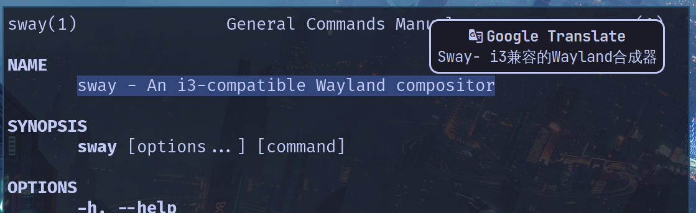

[中文介绍](README-zh.md)

# Sway DE configuration

This repo aimed to backup my configuration.

## Configuration

### WM(sway + waybar)

#### sway

1. Assign different workspaces to different applications
2. Set the font to Firacode Nerd Font
3. _Please modify the wallpaper path in sway/config by yourself_
4. Use rofi as the menu for application launch
5. Use slurp with wl-copy to achieve convenient and fast screenshot copy function (Ctrl+Alt+a)
6. Utilize `|` to make a simple translation tool (Ctrl+Alt+z)
7. A bunch of keys are set. In addition, there are some small tips :
   - alt+tab allows users to quickly switch to the previous workspace
   - alt+1/2 focus on the left/right workspace, using mod+num to switch workspace is also supported
   - Set `smart_gaps` to fill a little gap between windows and not waste space when there is only one window
   - `autotiling` automatically determine started window direction according to the aspect ratio of the previous window

#### waybar

Including:

- battery
- ram
- temprature
- pulseaudio
- bluetooth
- network
- workspaces
- mini-forest : My personal application
- book search : search books in specific directory
- date & clock

The complete collection of symbols is in [Nerd Font](https://www.nerdfonts.com/cheat-sheet)

### terminal environment(zsh + alacritty + tmux + neovim)

see 

## Others

All background wallpapers are under `image/wallpaper`
