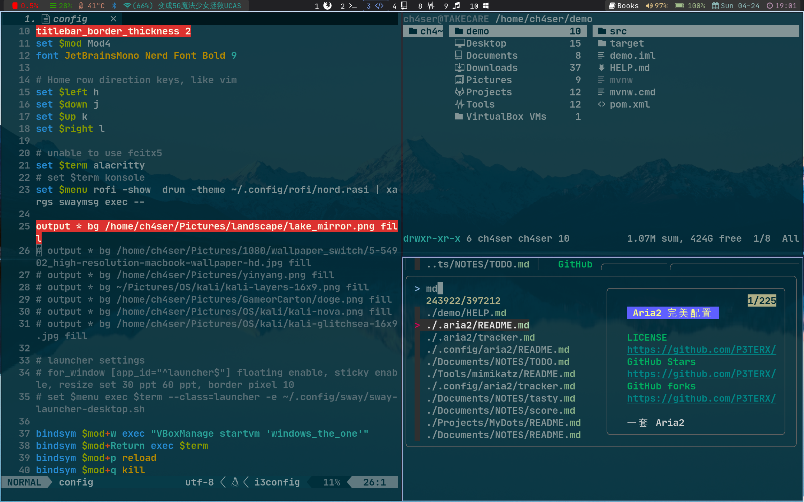
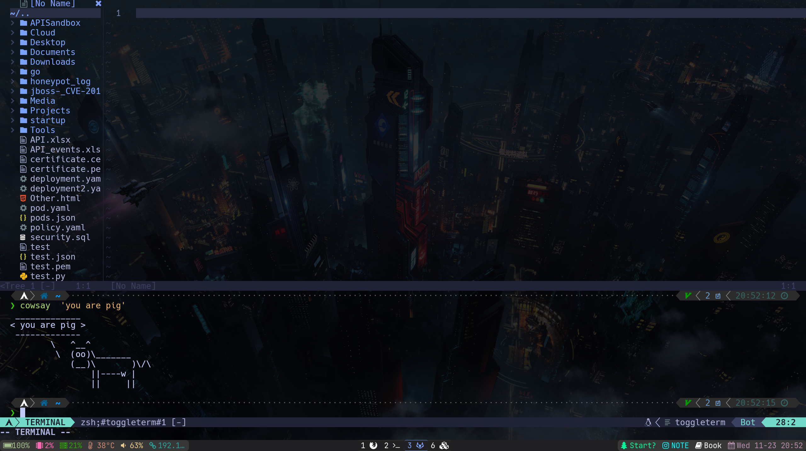
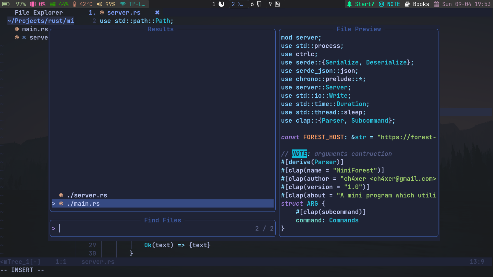
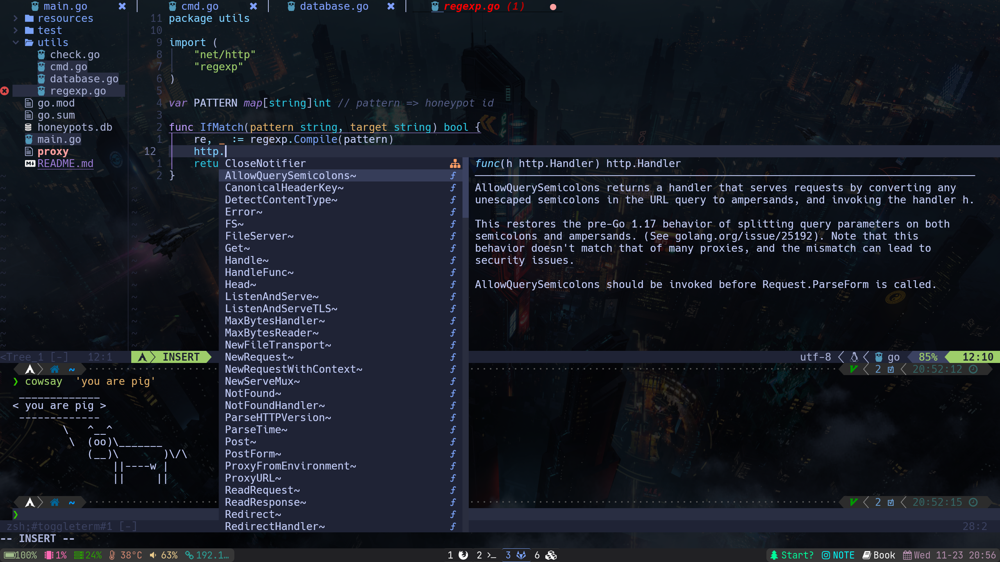
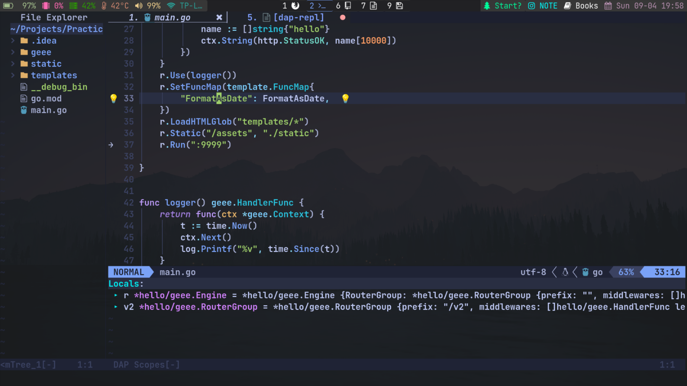
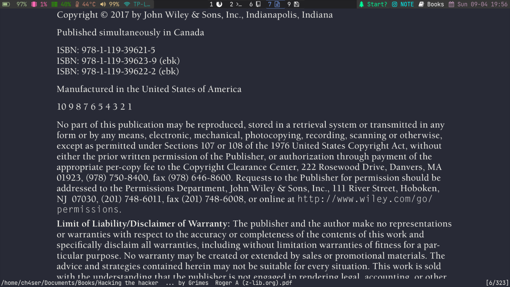
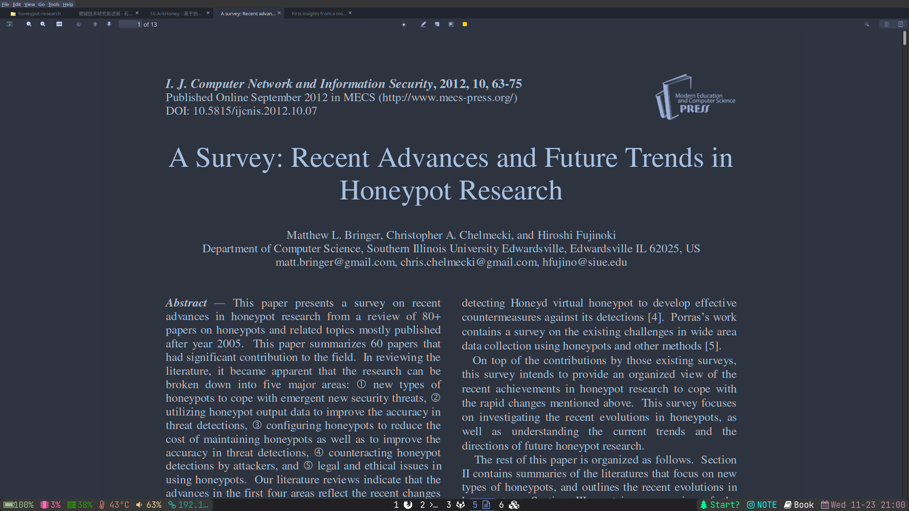

[中文介绍](README-zh.md)

# ch4xer's personal configuration

This repo aimed to backup my configuration, including configuration of sway, waybar, neovim, alacritty, kitty,zsh and ranger. Introductions are as follows. *Warning: Everyone has his/her own habit,this repo is for reference only*



<!-- toc -->

- [Configuration](#configuration)
  * [DE/WM(sway + waybar + swaylock)](#dewmsway--waybar--swaylock)
    + [sway](#sway)
    + [waybar](#waybar)
    + [swaylock(I dont use it because of some bugs)](#swaylocki-dont-use-it-because-of-some-bugs)
  * [terminal environment(zsh + kitty)](#terminal-environmentzsh--kitty)
    + [zsh](#zsh)
    + [Kitty](#kitty)
  * [browser(firefox)](#browserfirefox)
    + [firefox](#firefox)
  * [filemanager(ranger + dolphin)](#filemanagerranger--dolphin)
    + [ranger](#ranger)
  * [Editor/IDE (Neovim + nvim-qt + jetbrains)](#editoride-neovim--nvim-qt--jetbrains)
    + [Neovim](#neovim)
    + [nvim-qt](#nvim-qt)
    + [jetbrains](#jetbrains)
  * [reader(zathura+zotero)](#readerzathurazotero)
    + [zathura](#zathura)
    + [zotero](#zotero)
- [Others](#others)

<!-- tocstop -->

## Configuration
### DE/WM(sway + waybar + swaylock)
#### sway
1. Assign different workspaces to different applications
2. Set the font to Hack Nerd Font 
3. *Please modify the wallpaper path in sway/config by yourself*
4. Use rofi as the menu for application launch
5. Use slurp with wl-copy to achieve convenient and fast screenshot copy function
6. A bunch of keys are set. In addition, there are some small tips :
     - alt+tab allows users to quickly switch to the previous workspace
     - alt+1/2 focus on the left/right workspace, using mod+num to switch workspace is also supported
     - swap caplocks and esc positions for laptop keyboard
     - use `custom-pc` keyboard layout for my personal usb keyboard, you can delete or customize it by yourself
     - Set `smart_gaps` to fill a little gap between windows and not waste space when there is only one window
     - `autotiling` automatically determine started window direction according to the aspect ratio of the previous window

#### waybar
Including:
- battery
- gpu usage
- ram
- temprature
- pulseaudio
- network
- workspaces
- mini-forest : My personal application
- NOTE shortcut : To open my note with nvim-qt
- book search : search books in specific directory
- date & clock

The complete collection of symbols is in [yrwq/nerdy](https://github.com/yrwq/nerdy/blob/main/chars.csv)

#### swaylock(I dont use it because of some bugs)
just some color settings and wallpaper setting

### terminal environment(zsh + kitty)
#### zsh
1. Add todo.sh command, every time you open the terminal, it will list the to-do items of the day
2. fzf option setting, cooperate with bat to realize fuzzy file preview, and define vim_fzf function to fuzzy query and open the query result file with nvim
3. use oh-my-zsh and install the plugin as follows
     - [zsh-syntax-highlighting](https://github.com/zsh-users/zsh-syntax-highlighting) for command line parameter highlighting
     - [zsh-autosuggestions](https://github.com/zsh-users/zsh-autosuggestions) for command prompt
     - [zsh-extract](https://github.com/le0me55i/zsh-extract) for fast decompression of all types of archives using the ``x`` command
     - [zsh-autoswitch-virtualenv](https://github.com/MichaelAquilina/zsh-autoswitch-virtualenv) is used to automatically activate the virtual environment when entering a project with a python virtual environment, and automatically end the virtual environment when leaving
    - [zsh-autocomplete](https://github.com/marlonrichert/zsh-autocomplete) for command completion
     - powerlevel10k theme
4. Set up some aliases and replace some tools
     - [exa](https://github.com/ogham/exa) replaces ls
     - [htop](https://htop.dev/) instead of top
     - [bat](https://github.com/sharkdp/bat) replaces cat
     - [zoxide](https://github.com/ajeetdsouza/zoxide) replaces cd and autojump
     - [rsync](https://github.com/WayneD/rsync) replaces cp

#### Kitty

Do not use alacritty any more, kitty is just more advanced.

Using the Tokyonight theme and Hack Nerd Font, the profile file has been given

### browser(firefox)

#### firefox
1. custom toolbar --> title bar --> density
2. `about:config` --> set `browser.compactmode.show` to true --> go toolbar adjust, select `density` to `compact`

ps: if firefox's font looks extremely small after change scale in sway, try to delete `~/.mozilla` and restart firefox, then all things will become normal.

### filemanager(ranger + dolphin)

#### ranger
- use [ranger_devicon_plugin](https://github.com/alexanderjeurissen/ranger_devicons) to show icons,customize icons for some folders
- use fzf & ag for fuzz file finder in ranger
    - press f to start finding from current directory
    - press ctrl-h to show hidden files
    - see https://github.com/ranger/ranger/wiki/Custom-Commands#fzf-integration  for details
- use [ranger_udisk_menu](https://github.com/SL-RU/ranger_udisk_menu) to mount usb device
- customize copy paste and cut command to let ranger paste file in different instances


### Editor/IDE (Neovim + nvim-qt + jetbrains)
#### Neovim

Just copy the config file to `~/.config/nvim` and open nvim, wait downloading `packer.nvim` finish, and finally execute `PackerUpdate` and `PackerCompile`

some screenshot:

call terminal in neovim


fuzzy file search


code completion


debug(golang)


#### nvim-qt
fcitx5 cannot input chinese under wayland kitty, so I use nvim-qt for chinse note-taking.

nvim-qt use `ginit.vim`for configuration，

run `:GuiFont *` to set font for nvim-qt

#### jetbrains

environment variables should be added to ensure java application to run normally.
```
_JAVA_AWT_WM_NONREPARENTING=1
```

### reader(zathura+zotero)

#### zathura
- set dark color



#### zotero

use dark theme  [zotero-night](https://github.com/tefkah/zotero-night)



## Others

All background wallpapers are under `image/wallpaper`
