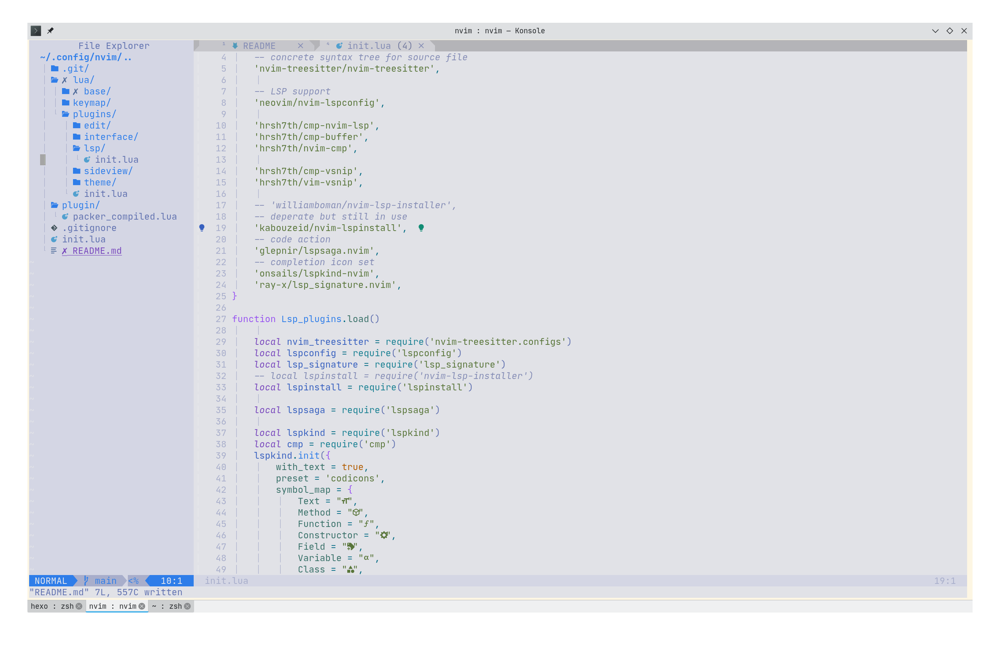
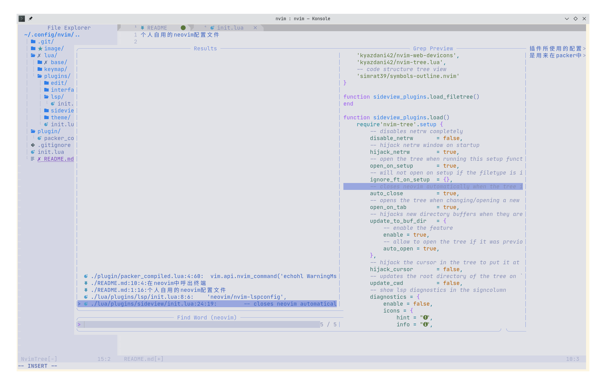
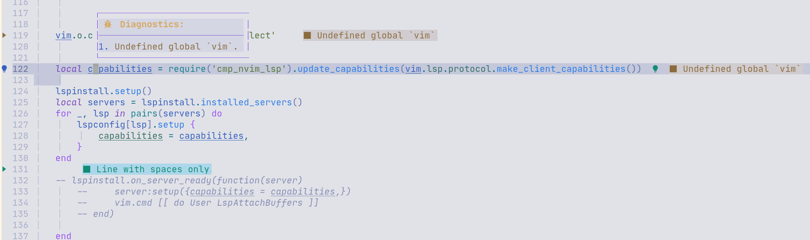

个人自用的neovim配置文件

这些配置文件对于像我一样对lua完全不熟悉但是又无意对lua深入学习但是又希望享受lua带来的好处的用户来说比较好理解。大部分插件所使用的配置都是从他们的项目中直接复制过来的，每一个插件的init.lua中包括了插件列表和load函数，load函数是用来setup插件的，插件列表是用来在packer中被use 的。

nvim-lspinstall插件已经不维护，但是我仍然使用，原因在于其替代品在使用过程中仍然存在bug。

几张截图


在neovim中呼出终端


模糊文件查找


代码补全


代码提示


如果发现换行的时候出现
```
E5108: Error executing lua ...site/pack/packer/start/nvim-cmp/lua/cmp/utils/keymap.lua:246: attempt to index local 'definition' (a nil value)
```
这是由于lsp-cmp插件导致的，具体原因作者也不知道，经过网友们测试将mkview和loadview取消掉就可以避免掉这个错误,但是这个功能也挺重要的，所以我没有注释掉

```
vim.o.viewoptions='folds,cursor,curdir'
vim.cmd('autocmd BufWinLeave * silent! mkview')
vim.cmd('autocmd BufEnter * silent! loadview')
```
